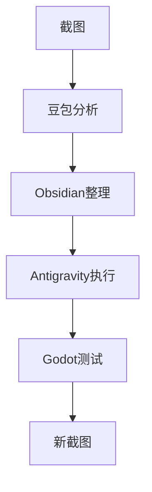
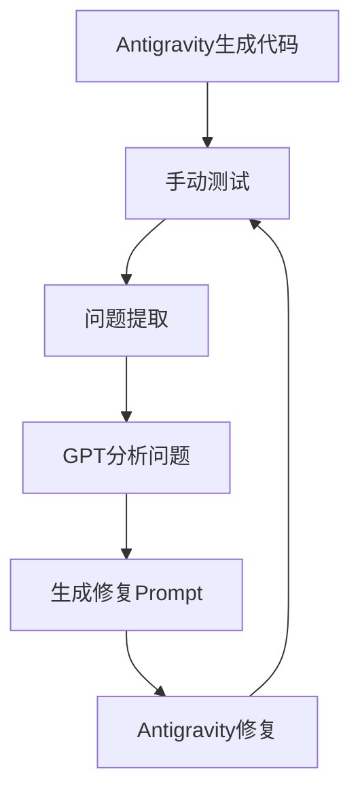

目前我在编写游戏代码这一块是使用的谷歌的antigravity来编写的代码，但是目前有一个游戏逻辑一直没有编写成功。我是使用的自然语言来告诉AI需要实现的效果，但是这样的结果并不理想。所以需要换一下具体的与AI的沟通方式。

UI构建

目前游戏逻辑功能实现的流程是

antigravity自动实现代码->测试一遍，找出问题，提出需求->实现功能的关键代码+需求提交给gpt->gpt给出prompt->antigravity重新修改代码